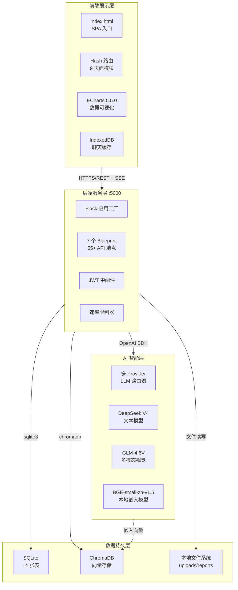
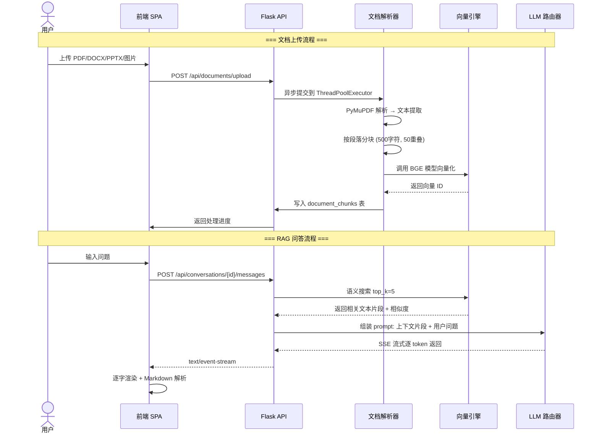
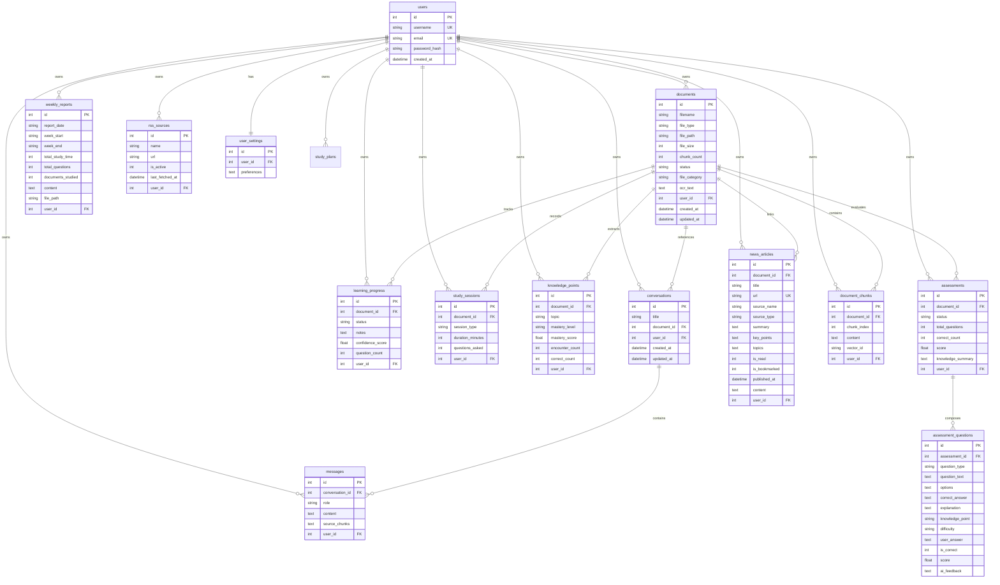
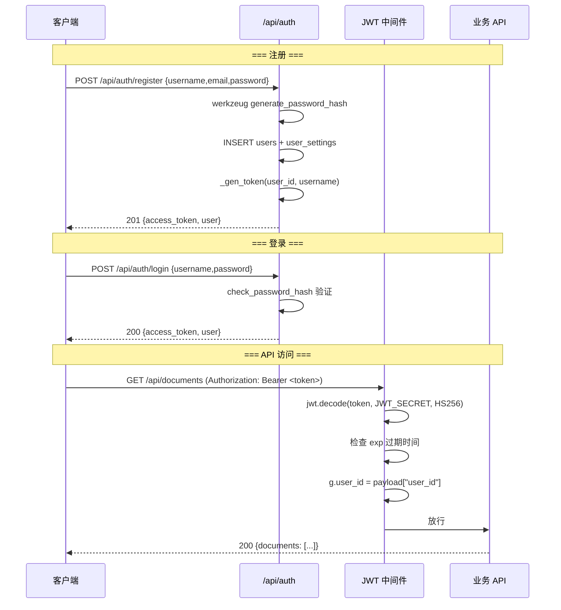

# 学习助手 v2.4 系统架构文档

> **版本**: 2.4.0 | **文档日期**: 2026-07-09 | **作者**: 学习助手开发团队

---

## 目录

1. [项目背景与定位](#1-项目背景与定位)
2. [系统架构总览](#2-系统架构总览)
3. [前端架构设计](#3-前端架构设计)
4. [后端架构设计](#4-后端架构设计)
5. [数据存储设计](#5-数据存储设计)
6. [安全设计](#6-安全设计)
7. [部署架构](#7-部署架构)
8. [关键设计决策](#8-关键设计决策)

---

## 1. 项目背景与定位

### 1.1 项目定位

**学习助手**是一个面向知识工作者的 RAG（检索增强生成）增强全科学习系统。它将大语言模型、向量语义检索和结构化学习管理三者深度融合，为个人用户提供从资料上传、智能问答、知识测评到进度追踪的完整学习闭环。

核心设计理念：

- **全科通用**：覆盖文、理、工、商、医、法、艺术等全领域，不局限于特定学科
- **RAG 增强**：所有 AI 回答均优先基于用户上传的学习资料，降低幻觉风险
- **个人工具**：单用户本地运行，数据完全自主可控，无需网络依赖
- **轻量级**：零配置启动，不依赖外部数据库或云服务

### 1.2 版本演进

| 版本 | 时间 | 主要变更 |
|------|------|---------|
| v1.0 | 2026-04 | 核心功能上线：Streamlit 前端 + Flask 后端，单 LLM (DeepSeek)，9 张 SQLite 表 |
| v2.0 | 2026-05 | 重构为纯 Vanilla JS SPA 前端，引入 JWT 用户认证，多 Provider LLM 架构 |
| v2.3 | 2026-06 | 新增多模态支持 (GLM-4.6V)，资讯模块、RSS 订阅追踪，学习计划模块 |
| v2.4 | 2026-07 | SSE 流式输出，异步文档处理，Flask-Limiter 速率限制，Swagger API 文档 |

从 v1.0 到 v2.4，系统从一个实验性原型逐步演进为功能完备的个人学习平台：
- 前端从 Streamlit 迁移到 Vanilla JS SPA，消除了双轨制维护负担
- LLM 从单 Provider 扩展为 OpenAI 兼容协议统一的多 Provider 架构
- 数据模型从 9 张表扩展至 14 张表，覆盖资讯、计划、用户设置等新场景
- 嵌入模型从 `all-MiniLM-L6-v2` (384维) 升级为 `bge-small-zh-v1.5` (512维)，中文语义理解显著提升

---

## 2. 系统架构总览

### 2.1 四层架构

系统采用经典的**四层架构**：前端展示层 → 后端服务层 → AI 智能层 → 数据持久层。



### 2.2 核心数据流



---

## 3. 前端架构设计

### 3.1 SPA 设计模式

前端采用**纯 Vanilla JavaScript**实现的单页应用（SPA），不依赖任何前端框架。

**路由机制**：

- 使用 **Hash 路由**（`#/dashboard`, `#/chat`, `#/library` 等）
- 监听 `hashchange` 事件驱动页面切换
- 路由表定义在 `frontend/js/app.js`，共映射 9 个页面模块
- 认证检查集成在路由守卫中：未登录自动跳转登录页

**模块加载策略**：

```javascript
// 动态导入 (ES Modules Dynamic Import) — 按需加载，减少首屏体积
const pages = {
  dashboard: () => import('./pages/dashboard.js'),
  chat:      () => import('./pages/chat.js'),
  library:   () => import('./pages/library.js'),
  // ... 共 9 个页面模块
};
```

每个页面模块独立打包，仅在首次访问时加载，后续切换由浏览器 HTTP 缓存命中。

### 3.2 组件化策略

前端功能按职责划分为以下层次：

| 层级 | 文件 | 职责 |
|------|------|------|
| 入口 | `app.js` | SPA 路由、应用壳渲染、认证守卫 |
| 认证 | `auth.js` | 登录/注册页面渲染、Token 管理 |
| API 层 | `api.js` | 统一请求封装：JWT 注入、SSE 流式读取、401 自动跳转 |
| 公共组件 | `components.js` | 顶栏导航、侧边栏、模态框等可复用 UI |
| 页面模块 | `pages/*.js` | 8 个功能页面，每个文件自包含渲染逻辑 |
| 工具 | `utils.js` | 日期格式化、Markdown 渲染等通用函数 |
| 缓存 | `chat-db.js` | IndexedDB 本地聊天持久化 |
| 样式 | `css/*.css` | 5 个 CSS 文件：reset、layout、components、pages、dashboard |

### 3.3 ECharts 数据可视化

仪表盘和进度页面使用 **ECharts 5.5.0**（CDN 引入）生成交互式图表：

- **学习进度仪表盘**：环形进度图展示整体完成率
- **知识点掌握度雷达图**：多维展示薄弱知识点分布
- **学习时长趋势**：折线图展示每日/每周学习时长变化
- **测评成绩分布**：柱状图展示历次测评得分

### 3.4 IndexedDB 本地缓存

前端使用 IndexedDB 实现对话状态本地持久化，数据库名 `ai_learning_chat`：

```javascript
// chat-db.js — 提供三个核心操作
saveChat(data)   // 保存当前对话（消息列表、会话ID、文档ID、模型）
loadChat()       // 恢复上次对话状态（页面刷新不丢失）
clearChat()      // 清空本地缓存
```

设计特点：
- 单 `chats` Object Store，key 固定为 `current`
- 存储完整的消息数组、会话 ID、关联文档 ID
- 与后端数据互为补充：后端为持久记录，IndexedDB 为快速恢复

### 3.5 响应式设计策略

采用 **Magazine Editorial Style**（杂志编辑风格）+ 暖色调调色板，CSS 采用移动优先策略：
- `layout.css`：Flexbox/Grid 布局、CSS 变量定义调色板
- `components.css`：按钮、卡片、输入框、模态框等组件样式
- `pages.css`：各页面特有布局
- `dashboard.css`：仪表盘专用网格系统

---

## 4. 后端架构设计

### 4.1 Flask Blueprint 模块化设计

后端采用 **Flask 应用工厂模式**，通过 7 个 Blueprint 实现模块化路由注册：

| Blueprint | 路由文件 | URL 前缀 | 主要端点 |
|-----------|---------|---------|---------|
| `auth_bp` | `auth_routes.py` | `/api/auth` | register, login, refresh, me, settings |
| `document_bp` | `document_routes.py` | `/api/documents` | upload, list, detail, delete, reparse, progress |
| `chat_bp` | `chat_routes.py` | `/api/conversations` | CRUD 对话、发送消息、流式输出、生成练习题 |
| `progress_bp` | `progress_routes.py` | `/api/progress` | 学习进度统计、知识点管理、学习会话 |
| `quiz_bp` | `quiz_routes.py` | `/api/assessments` | 创建测评、生成题目、提交答案、AI 评判 |
| `news_bp` | `news_routes.py` | `/api/news` | 资讯 CRUD、RSS 源管理、AI 摘要生成 |
| `dashboard_bp` | `dashboard_routes.py` | `/api/dashboard` | 仪表盘聚合数据 |
| `plan_bp` | `plan_routes.py` | `/api/plans` | 学习计划 CRUD |

共计 **55+ API 端点**，所有业务端点均受 `@require_auth` 装饰器保护。

**应用工厂结构**（`backend/app.py:32-275`）：

```python
def create_app():
    app = Flask(__name__)
    CORS(app)                             # 跨域支持
    Swagger(app)                          # API 文档 (/api/docs/)
    Limiter(app)                          # 速率限制 (500/天, 100/小时)
    # 注册 Blueprint
    app.register_blueprint(auth_bp)
    app.register_blueprint(document_bp)
    # ...
    init_db(); run_migrations()           # 数据库初始化
    return app
```

### 4.2 多 Provider LLM 路由器设计

`LLMService`（`backend/services/claude_service.py`）实现了多 Provider 统一路由：

```
┌─────────────────────────────────────────────────────┐
│                  LLMService Router                   │
├───────────────┬─────────────────────────────────────┤
│  文本模型      │  多模态模型                           │
│  DeepSeek V4   │  GLM-4.6V (智谱)                    │
│  OpenAI 兼容   │  OpenAI 兼容 + 图片 base64           │
├───────────────┴─────────────────────────────────────┤
│  统一接口: OpenAI SDK (chat.completions.create)      │
│  - 全局模型状态 (_current_global_model)              │
│  - 自动路由: 文本→DeepSeek, 图片→GLM-4.6V            │
│  - 网络异常自动重试 (3次, 指数退避 2s/4s/6s)         │
│  - 支持 stream=True 流式输出                         │
└─────────────────────────────────────────────────────┘
```

**多 Provider 配置**：通过 `MODEL_PROVIDERS` JSON 环境变量统一管理，支持运行时动态切换：

```json
[
  {"name": "DeepSeek V4 Flash", "base_url": "https://api.deepseek.com",
   "api_key": "sk-...", "model": "deepseek-v4-flash", "type": "text"},
  {"name": "智谱 GLM-4.6V", "base_url": "https://open.bigmodel.cn/api/paas/v4",
   "api_key": "...", "model": "glm-4.6v", "type": "multimodal"}
]
```

### 4.3 RAG 检索增强生成流程

系统 RAG 管线由 `DocumentService` 和 `VectorStore` 协同完成：

```
文档上传
    │
    ▼
┌────────────────────────────────────────────────┐
│ 1. 文档解析 (document_parser.py)               │
│    PDF → PyMuPDF | PPTX → python-pptx          │
│    DOCX → python-docx | 图片 → GLM-4.6V 视觉   │
└──────────────────┬─────────────────────────────┘
                   ▼
┌────────────────────────────────────────────────┐
│ 2. 文本分块 (chunk_text)                       │
│    chunk_size=500字符, chunk_overlap=50字符      │
│    按段落边界切分，保持语义完整性               │
└──────────────────┬─────────────────────────────┘
                   ▼
┌────────────────────────────────────────────────┐
│ 3. 向量化 (VectorStore)                        │
│    BGE-small-zh-v1.5 → 512维向量               │
│    ChromaDB PersistentClient                   │
│    批次大小: 100条/批                           │
└──────────────────┬─────────────────────────────┘
                   ▼
┌────────────────────────────────────────────────┐
│ 4. 语义搜索 (VectorStore.search)               │
│    查询向量化 → cosine 相似度 → top_k 片段       │
│    相似度阈值过滤: score > 0.3                  │
└──────────────────┬─────────────────────────────┘
                   ▼
┌────────────────────────────────────────────────┐
│ 5. LLM 生成 (LLMService.chat_stream)           │
│    System Prompt + 上下文片段 + 对话历史 + 问题  │
│    → OpenAI chat.completions.create(stream=True)│
└────────────────────────────────────────────────┘
```

### 4.4 SSE 流式输出实现

v2.4 新增 SSE（Server-Sent Events）流式输出，显著提升对话体验：

**后端**（`chat_routes.py:92-119`）：
```python
def _stream_response(conv_id, user_message, document_id, context_chunks):
    def generate():
        for chunk in llm_service.chat_stream(conv_id, user_message, ...):
            yield f"data: {json.dumps({'chunk': chunk})}\n\n"
        yield f"data: {json.dumps({'done': True, 'sources': context_chunks})}\n\n"
    return Response(stream_with_context(generate()), mimetype="text/event-stream")
```

**前端**（`api.js:78-126`）：使用 `ReadableStream` API 逐块读取 SSE 数据流，实时渲染到聊天界面，支持 AbortController 取消。

### 4.5 异步处理方案

对于耗时操作（文档解析、向量化），后端采用 **ThreadPoolExecutor** 异步方案：

```python
# document_routes.py
executor = ThreadPoolExecutor(max_workers=2)

@document_bp.route("/api/documents/upload", methods=["POST"])
def upload_document():
    doc_id = DocumentDAO.create(...)
    DocumentDAO.update_status(doc_id, "processing")
    executor.submit(_process_in_background, doc_id)  # 异步提交
    return jsonify({"status": "processing"})          # 立即返回
```

前端通过轮询 `/api/documents/{id}/progress` 端点获取实时处理进度（阶段标签 + 百分比）。

---

## 5. 数据存储设计

### 5.1 SQLite 数据模型

系统使用单文件 SQLite 数据库（WAL 模式，外键约束开启），共 **14 张表**：



**关键索引**（共 14 个）：

```sql
CREATE INDEX idx_chunks_doc     ON document_chunks(document_id);
CREATE INDEX idx_messages_conv  ON messages(conversation_id);
CREATE INDEX idx_progress_doc   ON learning_progress(document_id);
CREATE INDEX idx_knowledge_doc  ON knowledge_points(document_id);
CREATE INDEX idx_sessions_doc   ON study_sessions(document_id);
CREATE INDEX idx_reports_date   ON weekly_reports(week_start);
CREATE INDEX idx_assessments_doc ON assessments(document_id);
CREATE INDEX idx_aq_assessment  ON assessment_questions(assessment_id);
CREATE INDEX idx_news_user      ON news_articles(user_id);
CREATE INDEX idx_news_doc       ON news_articles(document_id);
CREATE INDEX idx_news_url       ON news_articles(url);
CREATE INDEX idx_rss_user       ON rss_sources(user_id);
```

**数据库迁移**：通过 `backend/migrations/` 目录下的 SQL 文件实现增量更新，`run_migrations()` 函数在每次启动时自动按文件名排序执行。

**DAO 层设计**：采用静态方法 DAO 模式，共 9 个数据操作类：
- `DocumentDAO`, `ConversationDAO`, `ProgressDAO`, `KnowledgeDAO`
- `StudySessionDAO`, `ReportDAO`, `AssessmentDAO`, `NewsDAO`, `RssSourceDAO`

### 5.2 ChromaDB 向量存储设计

**Collection 隔离策略**：

每个文档按 `user_{user_id}_doc_{doc_id}` 命名创建独立 Collection，实现用户级数据隔离：

```python
# vector_store.py
def _get_or_create_collection(self, doc_id, user_id=None):
    collection_name = f"user_{user_id}_doc_{doc_id}" if user_id else f"doc_{doc_id}"
    return self.client.get_or_create_collection(
        name=collection_name,
        metadata={"hnsw:space": "cosine"}  # 余弦相似度
    )
```

**向量索引配置**：

| 参数 | 值 | 说明 |
|------|-----|------|
| 嵌入模型 | `BGE-small-zh-v1.5` | 512 维中英文向量，本地离线运行 |
| ONNX 加速 | 自动尝试 | 优先 ONNX 后端，回退 PyTorch |
| 索引算法 | HNSW | ChromaDB 默认分层可导航小世界图 |
| 相似度度量 | cosine | 余弦相似度 |
| 批处理大小 | 100 条/批 | 避免单次写入过大 |
| 离线模式 | HF_HUB_OFFLINE=1 | 强制 HuggingFace 离线，不联网 |

**搜索策略**：

- **单文档搜索**：指定 `doc_id`，仅在对应 Collection 内检索
- **跨文档搜索**：`doc_id=None` 时，合并该用户所有 Collection 的检索结果，按距离排序取 top_k
- **相似度阈值**：过滤 `score < 0.3` 的低相关性片段

---

## 6. 安全设计

### 6.1 JWT 认证流程



**Token 配置**：

| 参数 | 默认值 | 说明 |
|------|--------|------|
| 签名算法 | HS256 | 对称加密 |
| 过期时间 | 7 天 | `JWT_EXPIRE_DAYS=7` |
| 密钥 | 随机生成 | 未配置时自动生成 32 字节 hex 密钥 |
| 载荷字段 | user_id, username, exp, iat | 最小化原则 |

**认证装饰器**（`middleware/auth.py`）：

- `@require_auth`：强制认证，未登录返回 401
- `@optional_auth`：可选认证，有 Token 解析 user_id，无则设为 None

### 6.2 用户数据隔离方案

`user_id` 贯穿所有数据层，实现完整的数据隔离：

| 层级 | 隔离方式 |
|------|---------|
| SQLite | 所有业务表均含 `user_id` 列，DAO 查询时自动附加 `WHERE user_id = ?` |
| ChromaDB | Collection 命名含 `user_{user_id}` 前缀，搜索时按前缀过滤 |
| 文件系统 | 上传文件按 `uploads/{user_id}/` 分目录存储 |
| API 层 | `g.user_id` 由 JWT 中间件注入，路由层传递给 Service/DAO |

**前端**：

- Token 存储在 `localStorage`，每次请求通过 `Authorization: Bearer <token>` 发送
- 401 响应自动清除 Token 并跳转登录页
- 登录/注册页面不渲染顶栏导航

---

## 7. 部署架构

### 7.1 单体部署

系统采用**单体部署**模式，所有组件运行在单一进程中：

```
┌──────────────────────────────────────────────┐
│            学习助手 v2.4 (进程)               │
│                                              │
│  Flask 内置服务器 (127.0.0.1:5000)            │
│  ├── 静态文件服务 (frontend/)                 │
│  ├── REST API (55+ 端点)                      │
│  ├── SSE 流式端点                             │
│  ├── ThreadPoolExecutor (max_workers=2)       │
│  └── Flask-Limiter 速率限制                   │
│                                              │
│  本地依赖：                                   │
│  ├── data/learning.db (SQLite)               │
│  ├── data/vector_db/ (ChromaDB)              │
│  ├── data/uploads/ (用户文件)                 │
│  ├── data/reports/ (周报导出)                 │
│  └── embedding_model/bge-small-zh-v1.5/      │
└──────────────────────────────────────────────┘
```

### 7.2 启动流程

**前置条件**：Python 3.10+, virtual environment, 嵌入模型已下载

**启动命令**：

```bash
# Windows (start.bat)
.venv\Scripts\activate
python -m backend.app

# Linux/Mac
source .venv/bin/activate
python -m backend.app
```

**启动日志示例**：

```
[2026-07-09 19:57:00] INFO 学习助手 v2.4 启动中...
[2026-07-09 19:57:00] INFO   API: http://127.0.0.1:5000
[2026-07-09 19:57:00] INFO   LLM configured: YES
[2026-07-09 19:57:00] INFO   Data dir: D:\...\data
[2026-07-09 19:57:01] INFO Swagger API 文档已启用: /api/docs/
[2026-07-09 19:57:01] INFO 速率限制已启用
[2026-07-09 19:57:01] INFO 迁移执行完毕
```

**启动后访问**：
- 应用界面：`http://127.0.0.1:5000`
- API 文档：`http://127.0.0.1:5000/api/docs/`
- 健康检查：`http://127.0.0.1:5000/api/health`

---

## 8. 关键设计决策

### 8.1 为什么用 Vanilla JS 而不是 React

**决策背景**：v1.0 使用 Streamlit 作为前端，v2.0 面临前端框架选择。

**选择 Vanilla JS 的理由**：

1. **MVP 阶段快速验证**：无需配置 Webpack/Vite 等构建工具，零构建成本即可运行
2. **学习曲线为零**：不引入 JSX、Virtual DOM、状态管理等概念，代码即所见
3. **部署极简**：静态文件直接由 Flask 服务，无需独立前端服务器或 CDN
4. **Hash 路由足够**：9 个页面的 SPA 不需要 React Router 的完整能力
5. **按需动态导入**：ES Modules `import()` 天然支持代码分割，无需打包器

**权衡接受**：当页面复杂度持续增长（超过 15 个页面、复杂状态管理需求），应考虑迁移到 React/Vue。

### 8.2 为什么用 SQLite 而不是 PostgreSQL

**决策背景**：需要结构化存储文档元数据、对话记录、学习进度等关系型数据。

**选择 SQLite 的理由**：

1. **零配置**：无需安装数据库服务器，`pip install` 后即开即用
2. **单用户足够**：个人学习工具的并发量几乎为零，SQLite 的 WAL 模式完全满足
3. **便携性**：整个数据库是一个单文件（`data/learning.db`），备份/迁移只需复制文件
4. **无网络依赖**：不依赖外部数据库服务，完全离线可用
5. **足够的功能**：支持外键约束、CHECK 约束、JSON、窗口函数等现代 SQL 特性

**性能考量**：SQLite 在 10GB 以内的数据量下性能不输 PostgreSQL，个人学习资料预计终身体量不超过 1GB。

### 8.3 为什么用 ChromaDB 而不是 Pinecone/Milvus

**决策背景**：需要向量数据库存储文档片段的嵌入表示。

**选择 ChromaDB 的理由**：

1. **本地部署**：`chromadb.PersistentClient` 直接在本地文件系统持久化，无需 Docker/K8s
2. **无需外网**：Pinecone 是云服务需要网络和 API Key，个人工具有隐私顾虑
3. **轻量级**：pip install 即可，不依赖外部服务编排
4. **HNSW 索引 + cosine 相似度**：满足 10 万级文档片段的检索需求
5. **Python 原生 API**：与 Sentence-Transformer 无缝集成

**与 Milvus 的对比**：Milvus 功能更强大（混合搜索、标量过滤、分布式），但需要 Docker 部署、ETCD/MinIO 等依赖，对单用户场景过于重量级。

### 8.4 为什么用 OpenAI 兼容协议统一多 Provider

**决策背景**：v2.0 引入多 LLM Provider（DeepSeek + GLM-4.6V），需要统一的调用接口。

**选择 OpenAI 兼容协议的理由**：

1. **生态兼容性**：DeepSeek、智谱 GLM、月之暗面等国产模型均提供 OpenAI 兼容 API
2. **统一的 SDK**：Python `openai` 包可直接用于所有 Provider，无需维护多套 SDK
3. **代码复用**：`chat.completions.create()` 一个方法覆盖文本对话、流式输出、多模态等所有场景
4. **易于扩展**：新增 Provider 只需添加一行 JSON 配置，无需修改业务代码
5. **自动路由**：文本模型和多模态模型共享 `LLMService` 接口，调用方无需关心底层实现

**架构体现**（`claude_service.py:30-168`）：

```python
class LLMService:
    def __init__(self):
        self._clients = {}   # {provider_id: OpenAI(api_key, base_url)}
        self._models = {}    # {provider_id: {type, model, max_tokens}}

    @property
    def client(self):
        model_id = get_current_model()
        return self._clients.get(model_id)
```

---

## 附录

### A. 技术栈汇总

| 类别 | 技术 | 版本 |
|------|------|------|
| 后端框架 | Flask | 3.1.1 |
| CORS | Flask-CORS | 5.0.1 |
| LLM SDK | OpenAI Python | 1.68.2 |
| 向量数据库 | ChromaDB | 1.2.2 |
| 嵌入模型 | BGE-small-zh-v1.5 (Sentence-Transformers 4.1.0) | 512维 |
| 关系数据库 | SQLite 3 (WAL 模式) | - |
| 文档解析 | PyMuPDF / python-pptx / python-docx | 1.25.5 / 1.0.2 / 1.1.2 |
| Markdown | Python Markdown | 3.7 |
| JWT | PyJWT | 2.9.0 |
| 速率限制 | Flask-Limiter | 3.8.0 |
| API 文档 | Flasgger (Swagger UI) | 0.9.7.1 |
| RSS 解析 | feedparser / BeautifulSoup4 | 6.0.11 / 4.12.3 |
| 前端 UI | Vanilla JS (ES Modules) | - |
| 图表库 | ECharts | 5.5.0 |
| 字体 | Google Fonts (Bodoni Moda) | - |
| 密码哈希 | Werkzeug Security | - |
| 测试 | pytest / pytest-flask / pytest-cov | 8.4.0 |

### B. 目录结构

```
AI学习助手2.0/
├── backend/
│   ├── app.py                  # Flask 应用工厂
│   ├── middleware/
│   │   └── auth.py             # JWT 认证装饰器
│   ├── migrations/             # 数据库增量迁移 SQL
│   │   ├── 001_add_users.sql
│   │   ├── 002_add_file_category.sql
│   │   ├── 003_add_news.sql
│   │   ├── 004_add_news_content.sql
│   │   └── 006_add_study_plans.sql
│   ├── models/
│   │   └── database.py         # 表定义 + 9 个 DAO 类
│   ├── routes/
│   │   ├── auth_routes.py
│   │   ├── chat_routes.py
│   │   ├── dashboard_routes.py
│   │   ├── document_routes.py
│   │   ├── news_routes.py
│   │   ├── plan_routes.py
│   │   ├── progress_routes.py
│   │   └── quiz_routes.py
│   ├── services/
│   │   ├── claude_service.py   # 多 Provider LLM 路由器
│   │   ├── document_parser.py  # 文档解析 + 分块
│   │   ├── document_service.py # 文档处理全流程
│   │   ├── news_service.py     # 资讯聚合服务
│   │   ├── report_service.py   # 周报生成服务
│   │   └── vector_store.py     # ChromaDB 向量存储
│   └── utils/
│       └── logger.py           # 统一日志模块
├── frontend/
│   ├── index.html              # SPA 入口
│   ├── css/                    # 5 个样式文件
│   └── js/
│       ├── app.js              # 路由 + 页面切换
│       ├── api.js              # API 封装 (含 SSE)
│       ├── auth.js             # 认证相关
│       ├── chat-db.js          # IndexedDB 缓存
│       ├── components.js       # 公共组件
│       ├── utils.js            # 工具函数
│       └── pages/              # 8 个页面模块
├── data/                       # 运行时数据目录
│   ├── learning.db             # SQLite 数据库
│   ├── vector_db/              # ChromaDB 持久化
│   ├── uploads/                # 用户上传文件
│   └── reports/                # 周报导出
├── embedding_model/            # 离线嵌入模型
│   └── bge-small-zh-v1.5/
├── config.py                   # 全局配置 (从 .env 加载)
├── .env                        # 环境变量 (不入库)
├── requirements.txt            # Python 依赖
├── start.bat                   # Windows 启动脚本
└── tests/                      # pytest 测试套件
```

---

> **文档维护说明**：本文档随系统架构演进持续更新。重大架构变更（如引入新数据源、替换核心组件）需同步更新本文档对应章节。日常功能迭代仅需更新 API 端点数量、表数量等统计数字。
