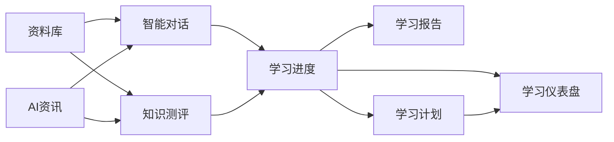

# 核心模块文档

> 学习助手 v2.4 — 功能模块详细说明

## 模块概览

学习助手共 9 个功能模块，覆盖从知识获取到掌握评估的完整学习闭环。



---

## 1. 学习仪表盘（v2.4 新增）

### 功能描述
默认首页，聚合所有学习数据提供可视化概览。

### API 端点

| 方法 | 路径 | 说明 |
|------|------|------|
| GET | `/api/dashboard/overview` | 仪表盘概览数据 |
| GET | `/api/dashboard/heatmap` | 90 天学习热力图 |
| GET | `/api/dashboard/trend` | 8 周学习趋势 |

### 数据流
```
ProgressDAO + KnowledgeDAO + StudySessionDAO + NewsDAO
    → 聚合计算
    → JSON 响应
    → ECharts 渲染（热力图 + 折线图）
```

### 可视化组件
- **指标卡片**（4 个）：学习资料数、本周学习时长、测评次数、未读资讯
- **90 天热力图**：日历格式展示每日学习时长
- **8 周趋势折线图**：周维度学习时长变化
- **薄弱知识点提醒**：红色高亮需复习的知识点

### 关键设计决策
- 作为默认首页：让用户每次打开应用先看到学习全局
- 热力图选择日历布局而非柱状图：日历更直观，符合"习惯追踪"的产品体验

---

## 2. 智能对话

### 功能描述
基于 RAG（检索增强生成）的 AI 问答，支持 SSE 流式输出和多模态图片分析。

### API 端点

| 方法 | 路径 | 说明 |
|------|------|------|
| GET | `/api/conversations` | 对话列表 |
| POST | `/api/conversations` | 创建对话 |
| GET | `/api/conversations/<id>` | 获取消息 |
| POST | `/api/conversations/<id>/messages` | 发送消息（SSE 流式） |
| DELETE | `/api/conversations/<id>` | 删除对话 |

### RAG 数据流
```
User Question
    → Sentence-Transformer 嵌入（512 维向量）
    → ChromaDB cosine 相似度搜索（top_k 片段）
    → 组装增强 Prompt
    → LLM 流式生成
    → SSE 逐 token 推送前端
```

### 关键参数
- 文本分块：500 tokens，50 tokens 重叠
- 语义搜索：top_k=3，相似度阈值 > 0.3
- 上下文窗口：将检索片段前置，标注"优先基于资料回答"

### 多模态支持
- 图片上传后 base64 编码
- 自动切换到多模态 Provider（GLM-4.6V）
- 支持图片内容分析 + 文字问答

---

## 3. 学习计划（v2.4 新增）

### 功能描述
AI 根据学习主题、当前水平、可用时间自动生成结构化学习计划，支持每日打卡和进度追踪。

### API 端点

| 方法 | 路径 | 说明 |
|------|------|------|
| POST | `/api/plans/generate` | AI 生成学习计划 |
| GET | `/api/plans/list` | 计划列表 |
| GET | `/api/plans/<id>` | 计划详情 |
| PUT | `/api/plans/<id>/progress` | 更新每日进度 |

### 生成流程
```
用户输入（主题 + 天数 + 水平 + 每日时长）
    → LLM 生成 JSON（daily tasks + goals）
    → 解析 + 入库
    → 前端时间轴展示
```

### 计划结构
```json
{
  "topic": "机器学习基础",
  "overview": "7天掌握机器学习核心概念",
  "days": [
    {"day": 1, "title": "什么是机器学习", "goal": "...", "tasks": [...]},
    {"day": 2, "title": "监督学习", ...}
  ]
}
```

---

## 4. 资料库

### 功能描述
文档上传、解析、分块、向量化的完整管道。支持 PDF/PPTX/DOCX/MD/TXT/图片。

### API 端点

| 方法 | 路径 | 说明 |
|------|------|------|
| GET | `/api/documents` | 文档列表 |
| POST | `/api/documents/upload` | 上传文档 |
| GET | `/api/documents/<id>` | 文档详情（含分块） |
| DELETE | `/api/documents/<id>` | 删除文档 |
| GET | `/api/documents/<id>/progress` | 处理进度轮询 |
| POST | `/api/documents/<id>/reparse` | 重新解析 |

### 处理管道
```
上传文件 → ThreadPoolExecutor 异步处理：
    1. 解析（PyMuPDF/python-pptx/python-docx）
    2. 分块（段落感知，500 tokens/块，50 tokens 重叠）
    3. 嵌入（Sentence-Transformer，512 维）
    4. 存储（ChromaDB collection + SQLite document_chunks）
    5. 状态更新（processing → parsed）
```

### 支持的文件类型
| 类型 | 解析库 | 特殊处理 |
|------|--------|---------|
| PDF | PyMuPDF (fitz) | 多页合并 |
| PPTX | python-pptx | 含表格提取 |
| DOCX | python-docx | 含表格提取 |
| MD/TXT | 原生读取 | 多编码尝试 |
| 图片 | GLM-4.6V 多模态 | 视觉理解 + OCR |

---

## 5. 知识测评

### 功能描述
从文档内容自动生成测评题目，支持选择/判断/简答三种题型，LLM 评判（带本地回退）。

### API 端点

| 方法 | 路径 | 说明 |
|------|------|------|
| POST | `/api/assessments` | 创建测评（出题+知识点提取并发） |
| GET | `/api/assessments/<id>` | 获取测评详情 |
| POST | `/api/assessments/<id>/submit` | 提交答案 |
| GET | `/api/assessments/<id>/status` | 状态轮询 |
| GET | `/api/assessments/history` | 测评历史 |

### 出题策略
- **题型配比**：判断题 25% + 选择题 50% + 简答题（余量）
- **难度配比**：简单 25% + 中等 50% + 较难（余量）
- **知识点关联**：每道题标注对应知识点
- **并发优化**：出题 + 知识点提取并发执行

### 评判机制
- **LLM 优先**：选择题精确匹配，简答题语义评判（20s 超时）
- **本地回退**：LLM 不可用时，选择题精确比对，简答题默认 0.5 分

### 评分标准
| 题型 | 满分 | 评判方式 |
|------|------|---------|
| 判断 | 1.0 | 精确匹配 |
| 选择 | 1.0 | 选项字母匹配 |
| 简答 | 0.0/0.5/1.0 | 核心概念到位程度 |

---

## 6. 学习进度

### 功能描述
五级掌握度体系追踪每个知识点的掌握状态，支持热力图和日历可视化。

### API 端点

| 方法 | 路径 | 说明 |
|------|------|------|
| GET | `/api/progress` | 进度列表 |
| GET | `/api/progress/stats` | 学习统计 |
| GET | `/api/progress/overview` | 学习概览 |
| GET | `/api/progress/calendar` | 90 天日历 |
| GET | `/api/progress/mastery` | 五级掌握度 |
| GET | `/api/knowledge/weak` | 薄弱知识点 |

### 五级掌握度体系
| 等级 | 名称 | 判定条件 |
|------|------|---------|
| L0 | 未接触 | 测评次数 = 0 |
| L1 | 入门 | 测评次数 >= 1，均分 < 60 |
| L2 | 熟悉 | 测评次数 >= 1，均分 >= 60 |
| L3 | 精通 | 测评次数 >= 2，均分 >= 80 |
| L4 | 专家 | 测评次数 >= 3，均分 >= 90 |

### 掌握度计算
```
每次测评后更新：
  mastery_score = (correct_count / total_questions) × 100
  mastery_level = 根据 mastery_score 和 encounter_count 判定 L0-L4
```

---

## 7. 学习报告

### 功能描述
AI 自动分析本周学习数据，生成结构化周报（Markdown 格式），支持下载。

### API 端点

| 方法 | 路径 | 说明 |
|------|------|------|
| POST | `/api/reports/generate` | 生成周报 |
| GET | `/api/reports` | 报告列表 |
| GET | `/api/reports/<id>` | 报告详情 |
| GET | `/api/reports/<id>/download` | 下载 Markdown |

### 报告结构
```
1. 整体评价（2-3 句话总结学习状态）
2. 学习亮点（1-3 个值得肯定的方面）
3. 薄弱环节（针对性改进建议）
4. 下周计划（基于薄弱点推荐方向）
```

---

## 8. AI 资讯追踪

### 功能描述
14 个预置 AI 行业 RSS 源 + URL 手动导入，AI 自动生成摘要、识别趋势、生成综合报告。

### API 端点（19 个）
核心端点：
- `POST /api/news/articles` — 导入 URL 文章
- `POST /api/news/fetch-all` — 抓取全部 RSS
- `POST /api/news/digest` — 生成 AI 日报/周报
- `POST /api/news/consolidate-stream` — 流式综合报告
- `GET /api/news/trends` — 热点趋势分析

### RSS 源列表
中文：机器之心、量子位、36氪、虎嗅、雷锋网、极客公园、少数派
英文：ArXiv cs.AI、TechCrunch AI、The Verge AI、Hacker News、VentureBeat AI、OpenAI Blog、Anthropic Blog

### 处理管道
```
RSS 抓取 → 去重 → 正文提取（BeautifulSoup）
    → LLM 摘要生成（批量处理减少 API 调用）
    → 热点趋势分析（LLM 聚合多篇文章）
    → 综合报告（SSE 流式输出）
```

---

## 9. 系统设置

### 功能描述
模型热切换、多 Provider 管理、账户信息查看。

### 关键能力
- **多 Provider 架构**：支持同时配置多个 LLM 提供商
- **热切换**：无需重启服务，即时生效
- **Provider 类型**：text（对话/出题/评判）和 multimodal（图片分析）
- **自动路由**：根据任务类型自动选择合适模型

---

## 模块依赖关系

```
资料库 ─┬→ 智能对话（提供 RAG 上下文）
        ├→ 知识测评（提供出题素材）
        └→ 学习进度（记录文档学习状态）

智能对话 + 知识测评
        └→ 学习进度（更新知识点掌握度）

学习进度
    ├→ 学习报告（提供数据源）
    ├→ 学习计划（识别薄弱点）
    └→ 学习仪表盘（聚合展示）

学习计划 → 学习仪表盘（显示进度）
```

## 数据闭环

整个系统的核心是一个**学习数据闭环**：

```
获取知识（资料上传/资讯导入）
    → 理解知识（RAG 问答）
        → 检验知识（AI 测评）
            → 追踪进度（掌握度计算）
                → 反馈调整（学习报告/计划）
                    → 强化薄弱点（回到问答/测评）
```

这个闭环使得学习过程从"一次性消费"变为"可持续优化"，是学习助手区别于通用 AI 聊天工具的核心价值。
